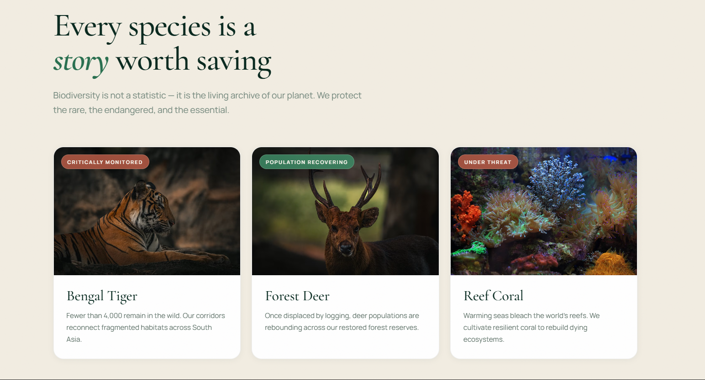
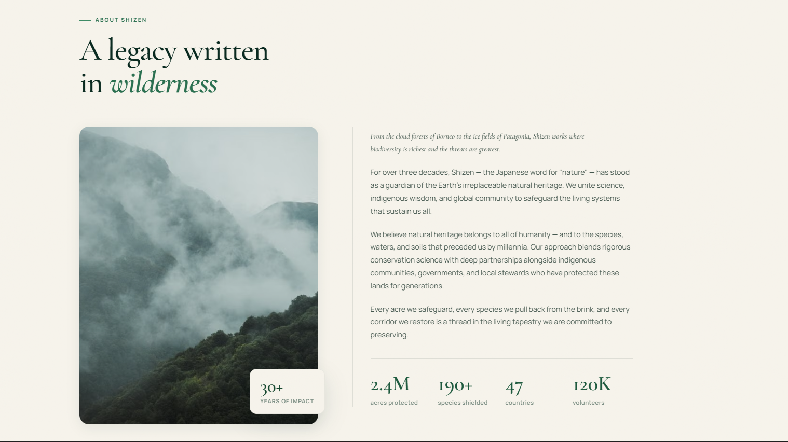
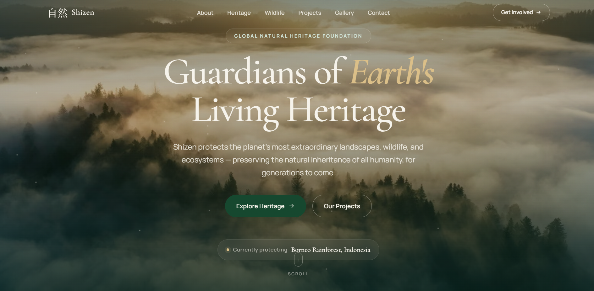

# Shizen

Shizen is a premium natural heritage and wildlife conservation landing page built with Vite, designed to create an immersive digital experience around nature, cultural heritage, wildlife, and environmental preservation.

The website combines **editorial-style storytelling, immersive photography, elegant typography, and a luxury visual system** to present natural landscapes and heritage sites in a sophisticated and engaging way.

## Preview

## About

Shizen is created around the idea that natural and cultural heritage should not simply be displayed, but experienced.

The website showcases remarkable landscapes, forests, mountains, caves, wildlife, and heritage destinations through carefully designed visual sections. Each section uses photography and concise storytelling to communicate the importance, beauty, and cultural value of these places.

The design takes inspiration from **premium editorial magazines, luxury travel brands, and modern conservation organizations**, creating a balance between visual beauty and environmental awareness.

The experience focuses on:

- Natural landscapes and ecosystems
- Wildlife and biodiversity
- Cultural and historical heritage
- Conservation and environmental awareness
- Visual storytelling through photography
- Minimal and immersive user interfaces
- Responsive experiences across desktop and mobile devices

## Design Philosophy

Shizen follows a **minimal, editorial, and timeless design philosophy**.

Large imagery is combined with generous spacing, refined typography, subtle animations, and carefully selected colors to create a calm and immersive experience.

The interface avoids unnecessary visual elements and focuses attention on the content, imagery, and stories being presented.

The overall visual language is inspired by:

- Luxury editorial websites
- Premium travel experiences
- Natural heritage publications
- Modern conservation platforms
- Contemporary portfolio design

## Brand Identity

The name **Shizen** represents a connection with nature and the natural world.

The brand is presented as a timeless conservation and heritage platform using:

- Deep forest-green tones
- Warm ivory backgrounds
- Restrained gold accents
- Elegant editorial typography
- Organic imagery
- Minimal interface elements

This combination creates a sophisticated visual identity while maintaining a strong connection to nature.

## Purpose

The purpose of Shizen is to **inspire people to discover, appreciate, and protect natural and cultural heritage**.

Rather than presenting conservation information as a traditional informational website, Shizen uses visual storytelling to create curiosity and encourage visitors to explore the places, wildlife, and heritage featured on the platform.

## Vision

Shizen aims to create a digital space where **nature, culture, history, and modern design come together**.

The long-term concept can be extended into a larger platform featuring heritage destinations, wildlife stories, conservation projects, travel experiences, educational content, and community initiatives.

## Project

This project was built as a modern frontend experience using lightweight web technologies and a custom visual design system.

The website is fully responsive and designed to provide a consistent experience across desktop, tablet, and mobile screen sizes.
